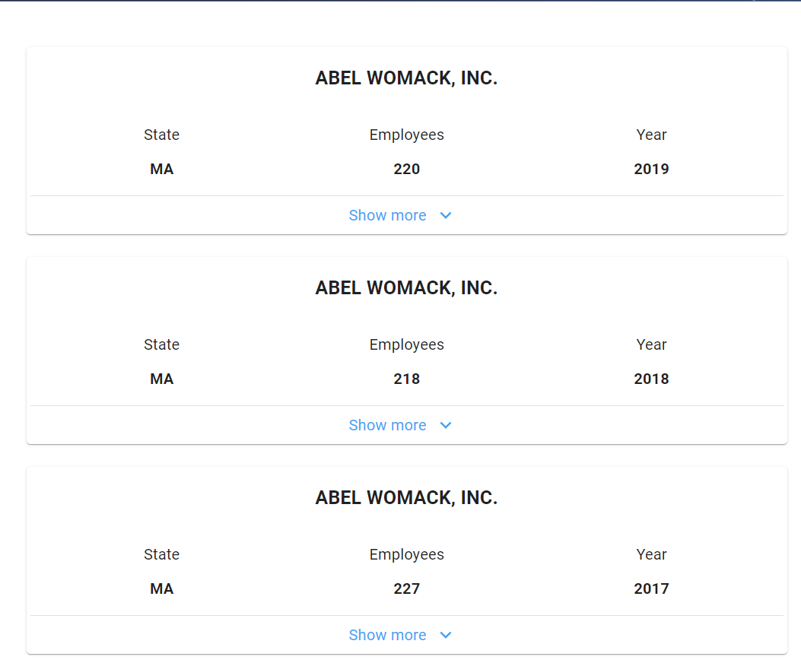
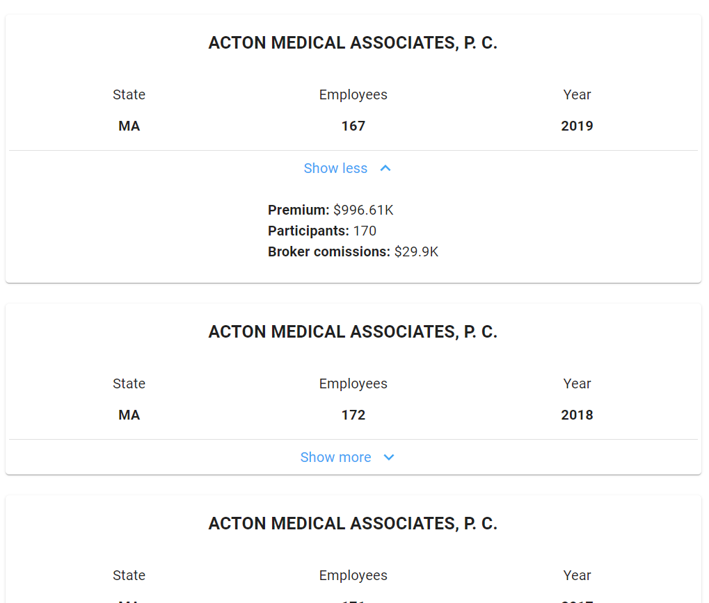
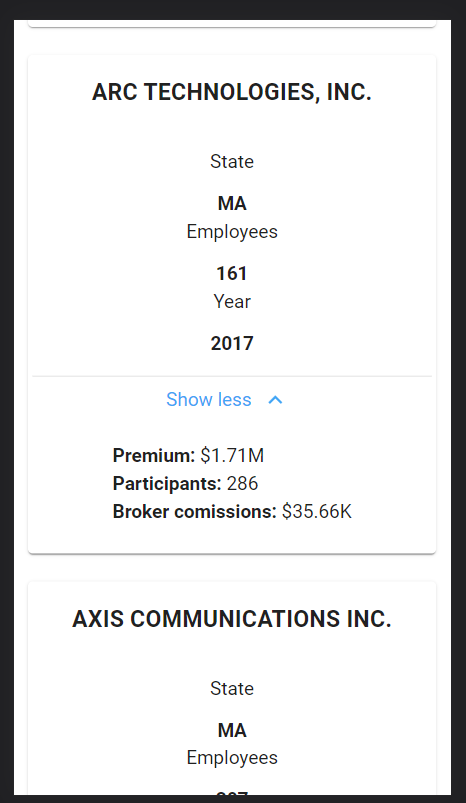

## Prompt
To allow for this problem to be re-used and for candidate fairness, I will keep this brief

Given a [set of companies data in JSON format](./src/json/companies.ts) render a UI listing companies data based on the requirements below. The dataset is publicly available.

### **Requirements**
- The cards containing company data should be centered on the page
- Each card should display company name, company state, plan year and employee count
- Clicking "More details" should display premium sum, broker commission and number of participants

*Mockups - Removed; see notes on problem re-use and fairness above*

- Basic cards with single black border
- Minor margin between cards and larger magin between card and page side
- 3 horizontal label/value pairs with a Show more button
- Clicking on button shows 3 column label/ value pairs

### Demo images

Taking creative license with the designs using MUI components

- Desktop: Default (unexpanded)  
   
- Desktop: Expanded  
   
- Mobile: Expanded  
   

## Design Decisions

### **Application setup / technology decisions**  

**CreateReactApp w/ Typescript:**  
I wanted to get started quickly, and CRA is a great tool for this. While would require extra steps to get to production, possibly requiring "ejection". For this coding exercise, it perfectly meets needs. I also wanted to use TypeScript  to demonstrate it's power and ease of use with IDE intellisense  

**Material UI (MUI) components:**  
MUI provides a lot of basic functionality out of the box, including animations, accessibility features, and a pleasing visual look. Note that if your app theme and design style guide differ greatly, overriding MUI components can come at maintenance and upgrade costs
*Wrapper Component* - I also provided an example of how you would create wrapper components for your application [See AppCard.tsx](./src/components/AppCard/AppCard.tsx). This allows for easier refactoring if going with another component library, creating custom components, or upgrading your component library

**ES-LINT/Prettier:**  
These are helpful tools that when combined with TypeScript improve the developer experience.

### **Folder structure**  

[See this image if viewing in markdown previewer, as indent is not maintained easily](./public/source_code_structure.png)
>/src  
    /pages #Only one currently, but can be used to expand to future routes later  
        /PageName  
            Page.tsx  
            Page.scss  
            constants.ts #Optional
            /components # These are components specifically scoped to the page
                /SubComponentName
                    SubComponentName.tsx
                    /SubSubComponentName  
    /components # App level components (shared amongst multiple pages)
    /types # App level types, often response from API
    /utils
        utilFile.ts  
    /constants  
        constants.ts # Only one file now, but could be broken out by purpose

*Notes:*  
Creating a /components folder scoped specifically to that page reduces clutter in the top-level /components folder and improves discoverability of components among developers (Storybook can also massively help this). Principles of DRY should be used in page-level components. Implementers and reviewers should make sure that functionality shared between page components should be moved to an app-level component (generally "rule of 3" is good here)

### Styling strategies - SCSS vs sx/style property/emotion
#1, **Do not** follow the exact styling strategy I used here if you can help it. What I mean by that is I mixed styling strategies within the same application; SCSS and style/*sx* property(on MUI components). 

I did this for 2 reasons, one to demonstrate the two different strategies as part of this prompt. Many people are familiar with .scss, and it remains powerful. The second reason was that MUI and other component libraries / frameworks can be extremely opinionated. They recommend using the *sx* properties for their components, and *emotion.sh* for their styling. For brevity, I did not adobt 

Lastly a mixed strategy is often the reality in production applications that have been around a while as new technologies/design patterns come out, but not time for addressing tech debt/upgrade.  

Discussing the relative pro's and con's between the two patterns is outside of the scope of this document. Searching for comparisons between SCSS, styled components, and CSS-in-JSX patterns will turn up a plethora of discussions  
### Mobile / Responsive design
As this was outside the scope of the prompt, I took a minimal approach by analyzing what designs took up a lot of space on smaller screens and used common mobile design patterns. Additionally this section was a chance to show how MaterialUI's *useMediaQuery* and *useTheme* hooks can be utilized

### Extra / future development
Some additional features that would be fun to implement or interesting
- User sorting by (company name state, employees, etc) - both ascending and descending using MUI
- User filter by (data fields as above) using MUI
- *BE implementation!* - Normalize companies data and insert in DB (possibly MongoDB for ease-of-use) and node/express API  

---
## Getting started

In the project directory, you can run:

### `yarn start`

Runs the app in the development mode.\
Open [http://localhost:3000](http://localhost:3000) to view it in the browser.

The page will reload if you make edits.\
You will also see any lint errors in the console.

---
## Future support
### `yarn test`

Launches the test runner in the interactive watch mode.\
See the section about [running tests](https://facebook.github.io/create-react-app/docs/running-tests) for more information.

### `yarn build`

Builds the app for production to the `build` folder.\
It correctly bundles React in production mode and optimizes the build for the best performance.

The build is minified and the filenames include the hashes.\
Your app is ready to be deployed!

See the section about [deployment](https://facebook.github.io/create-react-app/docs/deployment) for more information.

---
## Learn More

You can learn more in the [Create React App documentation](https://facebook.github.io/create-react-app/docs/getting-started).

To learn React, check out the [React documentation](https://reactjs.org/).
